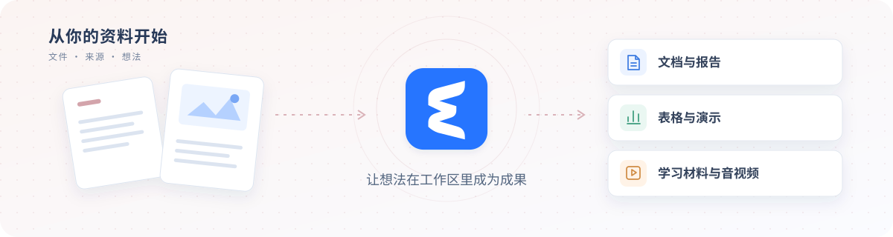
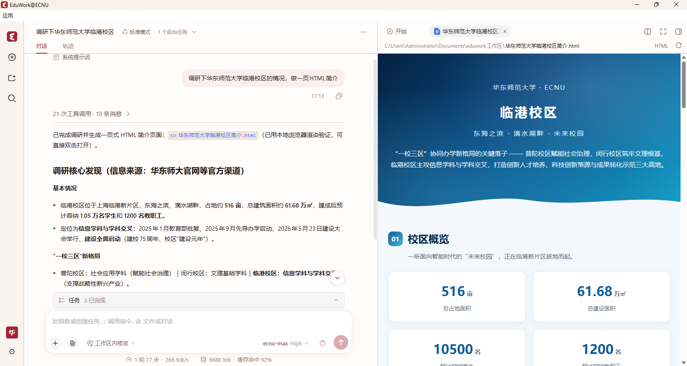
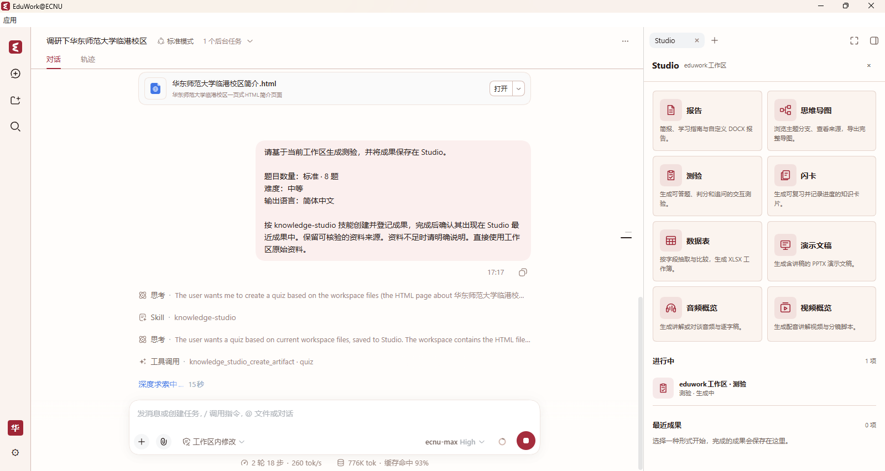

  

<h1 align="center">EduWork@ECNU</h1>

<strong>让学校的 AI 服务，走进你的日常工作。</strong> 面向华东师范大学师生的桌面 AI 工作助手

   

**简体中文** | [English](README_EN.md)

[校内搜索](#校内搜索) · [账户与配额](#账户与配额) · [机构扩展示例](#作为机构扩展的示例) · [详细文档](#详细文档)

EduWork@ECNU 将 [EduWork](https://github.com/ecnu/EduWork) 带到华东师范大学的教学、科研与办公场景。用学校账号登录，连接学校模型、查找校内信息，再围绕手头的资料完成任务。

它保留 EduWork 的完整工作区、Studio 和技能中心。学校服务通过配置与插件接入，用户也可以继续使用自己的 API Key 和其他模型。

同一个 EduWork 工作区，连接学校服务；蓝色与红色主题均可选择。

> 学校用户通过学校发布渠道获取客户端，首次启动自动下载学校配置。本仓库介绍机构扩展与开发方式，配置模板不包含完整的学校部署参数。

## 你可以用它做什么

<table>
<tr>
<td width="50%" valign="top"><h3>校内信息，随问随查</h3>
查找办事服务、机构院系、规章政策与校内新闻，在回答中保留原始来源。
</td>
<td width="50%" valign="top"><h3>可用资源，一眼了解</h3>
从账户菜单查看学校模型额度、资源池和重置时间，随时刷新、查看明细。
</td>
</tr>
<tr>
<td width="50%" valign="top"><h3>学校模型，登录接入</h3>
完成登录与授权后配置学校模型，使用学校提供的文生图和语音服务。
</td>
<td width="50%" valign="top"><h3>公共能力，完整保留</h3>
工作区、Studio、技能中心、记忆与邮件助手，继续围绕你的资料完成任务。
</td>
</tr>
</table>

### 校内搜索

在对话中查找华东师范大学的办事服务、机构院系、规章政策、校园设施、人员主页和校内新闻。Agent 可通过学校搜索服务定位相关页面，结合标题、摘要和来源链接整理回答；需要核实细节时，还可打开原页面继续阅读。

校内检索配有专门的技能指引：学校相关事项优先查找校内来源，综合研究时再结合公开网页和文献，区分来源并保留引用。实际检索范围以学校服务收录内容及账号权限为准。

> 帮我查找学校关于科研数据管理的相关规定，列出原文链接，并区分正式规定与新闻介绍。

### 账户与配额

点击左下角头像，就能查看学校账号及模型资源的使用情况：

- **使用额度**：显示配额窗口的剩余量、使用进度和下一次重置时间。
- **资源池与明细**：分别查看可用资源包的额度、有效期和状态，了解不同资源的剩余情况。
- **账户操作**：刷新配额、查看详情或退出登录，无需离开当前工作区。

配额查询使用学校专属接口，数值以服务端返回为准；个人 API Key 对应的额度仍由其服务商管理。

### 学校模型与媒体服务

使用学校账号完成认证和必要授权后，客户端自动获取模型凭据、配置学校模型。还可使用学校提供的文生图和语音合成服务，在对话或 Studio 中制作图片、配音及讲解内容；个人模型可以同时使用。

这些接入能力复用公版的 OIDC、模型和媒体适配器，由学校提供服务与配置。

### 其他学校扩展

| 扩展 | 用途与启用范围 |
| --- | --- |
| 图片理解辅助 | 使用所配置学校线路中的纯文本模型时，可由学校视觉模型分析图片，再将文字证据交给主模型。支持关闭；主模型原生支持图片时直接接收原图，不额外调用辅助模型。 |
| 活跃心跳 | 对接学校服务的客户端活跃状态。默认关闭，需服务端支持并由发行方显式开启；只发送安装标识、客户端基本信息及前后台状态，不读取对话或工作区文件内容。 |

### 围绕资料完成工作

选择本机文件夹作为工作区，让 EduWork 阅读和整理资料、分析数据、编辑文件或运行脚本。需要成果时，可直接在对话中提出要求，也可以打开 Studio：

- **报告、数据表与演示文稿**：生成 DOCX、XLSX、PPTX 文件。
- **思维导图、测验与闪卡**：整理知识关系，制作练习和复习材料。
- **音频与视频**：制作配音和讲解内容，预览并下载媒体与字幕。

对话与 Studio 共用生成、预览和下载能力。技能中心、本地记忆、邮件助手、浏览器、本机语音转写、系统语音合成和蓝/红配色也都保留。

## 配置与数据

学校接入参数、模型目录与能力、媒体服务、品牌和更新源由学校统一维护，客户端内置更新源与公钥，学校配置在首次启动时下载；模型目录、功能开关、媒体配置和官方 Skills 也可独立更新，在下次启动生效，使用者无需手动编辑配置。个人模型、登录凭据与历史数据单独保留。配置与公共核心代码分离。仓库提供配置模板，实际 Client ID 与部署参数由学校维护，见[机构配置示例](edition/desktop-examples/README.md)。

会话、工作区引用与记忆在本机管理。使用学校或其他远程模型、搜索及媒体服务时，任务所需内容会发送给相应服务。登录凭据由本机凭据存储管理，不要将密码或令牌写入配置文件。

遇到问题可在设置中导出诊断 ZIP；涉及某个对话时，可另行导出 Session log。参见[使用指南](docs/USER_GUIDE.md)。

## 作为机构扩展的示例

**让公共工作台接入你所在机构的服务。** 本仓库也是一个基于 EduWork 构建机构发行版的示例。

这也是[开放身份与模型接入倡议](https://github.com/ecnu/EduWork/blob/main/packages/dsh-oidc/docs/open-integration.md)的一个实践场景：学校身份与模型复用公开接入协议，校内检索、配额等服务通过机构插件补充。其他机构可以复用这套分工，将自己的服务带入公共工作台。

学校特性按配置、技能和插件分别维护：

| 方式 | 本仓库中的用途 |
| --- | --- |
| 配置 | 提供学校身份与模型、媒体服务、品牌和更新渠道的默认设置，复用公版已有的接入能力。 |
| 技能 | 描述校内检索等任务的使用方法，为 Agent 提供操作指引。 |
| 插件 | 接入校内搜索、账户配额、纯文本模型的图片理解辅助及可选的活跃心跳；心跳默认关闭，需服务端支持并显式启用。 |

通用 OIDC 登录、模型接入、文生图与 TTS 适配，以及工作台、Studio、预览、桌面和更新逻辑，都由 [EduWork](https://github.com/ecnu/EduWork) 维护。本仓库引用确定版本的公共核心，只追加机构配置和扩展。

其他学校或企业可以参考这种组织方式，编写自己的插件和技能，组合自己的默认配置。仅需标准身份、模型和媒体接口的机构，也可以直接为公版提供配置。结构与装配方法见[构建指南](docs/BUILD.md)及[公版扩展边界](https://github.com/ecnu/EduWork/blob/main/docs/EDITIONS.md)。

## 详细文档

| 文档 | 内容 |
| --- | --- |
| [ECNU 使用指南](docs/USER_GUIDE.md) | 学校登录、账户配额、服务配置与常见问题。 |
| [配置与 Skills 更新](https://github.com/ecnu/EduWork/blob/main/docs/CONTENT_UPDATES.md) | 同一更新入口检查软件和内容，分别显示版本与修订号。 |
| [配置示例](edition/desktop-examples/README.md) | 学校接入、模型、媒体、品牌与更新配置。 |
| [构建指南](docs/BUILD.md) | 引用公共核心、装配机构发行版与协作开发。 |
| [EduWork 使用指南](https://github.com/ecnu/EduWork/blob/main/docs/USER_GUIDE.md) | 工作区、模型、搜索、语音和文件操作。 |
| [版本与升级](https://github.com/ecnu/EduWork/blob/main/docs/RELEASE.md) · [更新源部署](https://github.com/ecnu/EduWork/blob/main/docs/UPDATES.md) | 版本规则、更新渠道与迁移要求。 |
| [macOS 说明](https://github.com/ecnu/EduWork/blob/main/docs/MACOS.md) | Mac 平台适配与贡献方式。 |

## 致谢与许可

EduWork@ECNU 基于 [EduWork](https://github.com/ecnu/EduWork) 与 [DeepSeek Harness](https://github.com/deepseek-ai/deepseek-harness) 构建。

本仓库代码采用 [MIT 许可证](LICENSE)。公共核心及第三方组件保留各自的许可证，参见 [EduWork 第三方声明](https://github.com/ecnu/EduWork/blob/main/THIRD_PARTY_NOTICES.md)。
