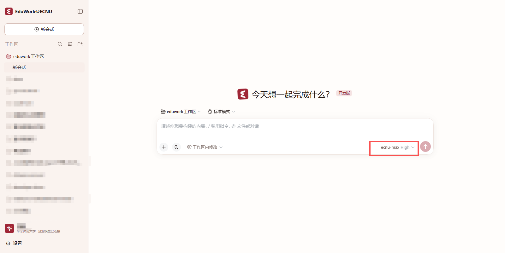
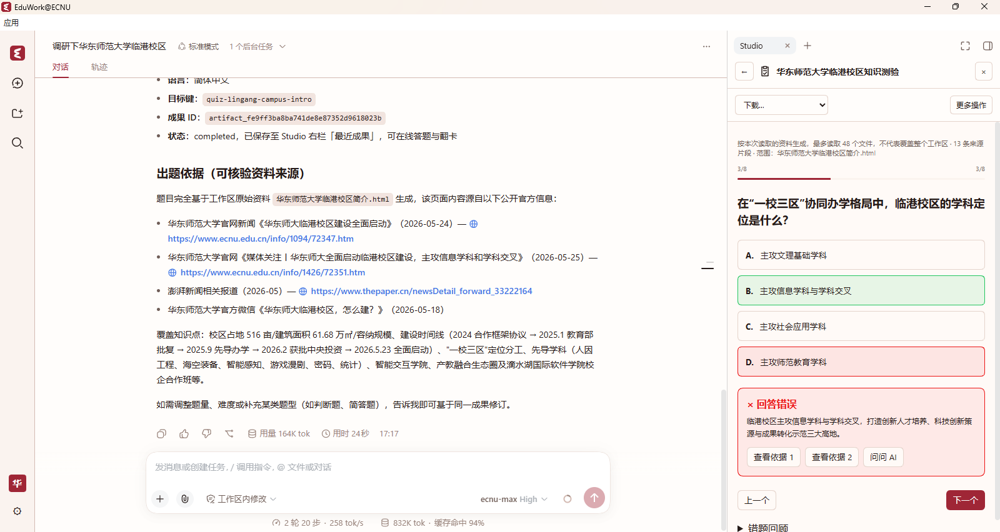
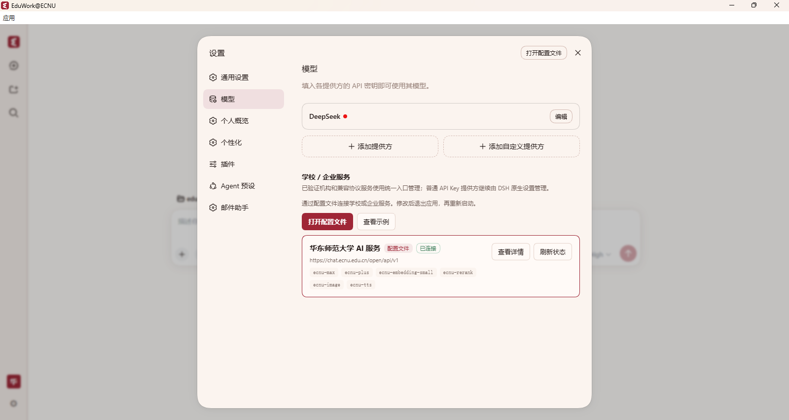

  

<h1 align="center">EduWork@ECNU</h1>

<strong>华东师大的 AI 知识工作台。</strong> 学校账号登录 · 校内服务 · Knowledge Studio

 

**简体中文** | [English](README_EN.md)

[学校账号接入](#学校账号接入) · [Knowledge Studio](#knowledge-studio) · [校内服务](#校内服务) · [开始使用](#安装与使用) · [公版 EduWork](https://github.com/ECNU/EduWork)

EduWork@ECNU 是 [EduWork](https://github.com/ECNU/EduWork) 的华东师范大学发行版。用学校账号连接模型，围绕教学、科研与办公资料展开对话，在 Knowledge Studio 中制作报告、演示文稿、测验与闪卡。

**公版提供开放接入与知识工作台，ECNU 版接入学校的模型和服务。** 你也可以继续使用个人 API Key 和其他模型。

## 学校账号接入

首次启动自动下载并验证学校配置。使用学校账号登录后，客户端获取你有权使用的模型，无需手动填写接口地址或复制模型 API Key。

登录后选择学校模型即可开始。图中使用 ecnu-max，实际可用模型以学校服务与账号权限为准。

学校身份与模型接入复用公版的开放协议实现。登录后，客户端自动管理模型授权与 Token 刷新；个人配置的模型可以同时使用。学校模型目录和能力通过配置维护，无需为每次调整重新下载整个程序。

## Knowledge Studio

**受 NotebookLM 启发，把资料变成可以阅读、使用和练习的知识成果。** ECNU 版使用公版同一套 Knowledge Studio，连接学校模型，在本机工作区开展创作与学习。

### 从资料到创作

在对话中调研、整理资料，生成的文件可以直接预览，也可以继续作为 Studio 的素材。下面的例子先制作一页临港校区 HTML 简介，再根据这份资料生成测验。

对话和成果并排呈现：查看生成的页面，也能继续讨论和修改。

打开右侧 Studio，选择一种成果形式：

| 创作与整理 | 理解与学习 |
| --- | --- |
| 报告、数据表、演示文稿 | 思维导图、测验、闪卡 |
| 导出 DOCX、XLSX、PPTX | 浏览引用、答题、查看解析、继续追问 |

音频和视频概览提供另一种阅读资料的方式。语音与媒体能力取决于已配置的学校服务、账号权限和本地资源。

从 Studio 发起生成，在侧栏查看进度；完成后从「最近成果」打开。

### 从阅读到学习

生成的测验可以直接答题，查看反馈、解析与资料依据，再通过「问问 AI」继续追问。闪卡用于复习，同一份资料也可以继续用于报告、演示文稿或思维导图。

从答案回到资料，再带着问题继续学习。

### 与公版共享的插件能力

Knowledge Studio 是独立插件，通过宿主的侧栏插槽（slot）接入工作台。新的成果类型和其他 Studio 界面可以通过插件扩展，具体适配与通用能力在公版维护，ECNU 版复用这些能力。

[了解 Knowledge Studio](https://github.com/ECNU/EduWork/tree/main/packages/dsh-knowledge-studio) · [Studio 架构与扩展接口](https://github.com/ECNU/EduWork/blob/main/packages/dsh-knowledge-studio/docs/ARCHITECTURE.md)

## 校内服务

### 校内搜索

在对话中查找办事服务、机构院系、规章政策、校园设施、人员主页和校内新闻，保留原始来源，必要时打开原页面核实。学校相关事项优先使用校内来源，综合研究时再结合公开网页与文献。

> 帮我查找学校关于科研数据管理的相关规定，列出原文链接，并区分正式规定与新闻介绍。

检索范围以学校服务收录内容及账号权限为准。

### 账户与配额

点击左下角头像，查看学校模型的剩余额度、使用进度和重置时间，也可以展开资源池明细、刷新配额或退出登录。

配额由学校服务端管理；个人 API Key 对应的额度仍由其服务商管理。配额查询属于 ECNU 扩展，与公版的通用身份和模型协议分别维护。

### 学校模型与媒体服务

在 **设置 → 模型** 查看学校服务连接状态和模型目录，也可以添加个人模型。学校图像与语音合成服务按配置和账号权限启用，可用于对话和 Studio 中的图片、配音及讲解内容。

学校服务与个人模型在同一处管理，实际可用能力由服务配置和账号权限决定。

使用所配置学校线路中的纯文本模型时，可由图片理解辅助调用学校视觉模型，将文字证据交给主模型；该能力可以关闭。原生支持图片的模型直接接收原图，不额外调用辅助模型。

## 安装与使用

支持 **Windows x64** 和 **macOS 15+ Apple Silicon（arm64）**。客户端在自己的电脑上运行，无需额外部署 EduWork 服务端。

1. 从学校发布渠道或 [GitHub Releases](https://github.com/ECNU/EduWork-ECNU/releases) 获取对应平台的完整桌面包。Windows 解压到可写目录，运行 `EduWork-Electron.exe`，保留同目录的资源；Mac 解压后将 `EduWork-ECNU.app` 放入“应用程序”。GitHub 的 Source code 压缩包不是桌面包。
2. 首次启动联网下载学校配置，按引导使用学校账号登录并授权。返回客户端后，确认学校服务已连接，再选择模型。
3. 选择本机文件夹作为工作区并放入资料，直接开始对话，或打开 Studio 选择成果类型。

可以先试试：**“根据这些资料生成一份学习指南，再制作配套测验。”**

macOS 当前未使用 Apple Developer ID 签名或公证，首次打开可能出现系统安全提示。软件更新、系统授权与平台要求见 [macOS 说明](https://github.com/ECNU/EduWork/blob/main/docs/MACOS.md)和 [Mac 更新说明](https://github.com/ECNU/EduWork/blob/main/docs/MACOS_UPDATES.md)。学校登录与常见问题见[使用指南](docs/USER_GUIDE.md)。

## 配置与数据

学校统一维护默认接入参数、模型与媒体配置、品牌和更新源。模型配置、功能开关、媒体配置和官方 Skills 可独立更新，重启后生效；日常使用无需手动填写学校参数。

需要调整时，从设置打开唯一生效的 `eduwork.jsonc`，文件内包含配置注释。配置更新保留手工修改，自动改写前只保留一份上一版配置用于回退。个人模型、登录凭据和历史数据单独保存。

| 平台 | 生效配置位置 |
| --- | --- |
| Windows | 程序目录中的 `config/eduwork.jsonc`，配置和应用数据随绿色版目录保存。 |
| macOS | `~/Library/Application Support/eduwork-chatecnu-electron/config/eduwork.jsonc`，配置和应用数据位于用户目录。 |

工作区文件仍在你选择的文件夹中；移动程序不会自动移动外部工作区。仓库提供[机构配置示例](edition/desktop-examples/README.md)，实际学校部署参数在首次启动时获取，不包含在源码模板中。

### 数据与隐私

会话、工作区引用与记忆在本机管理。使用学校或其他远程模型、搜索及媒体服务时，任务所需内容会发送给相应服务。登录凭据由本机凭据存储管理，不要将密码或令牌写入配置文件。

**学校发行已启用活跃心跳。** 登录学校账号后，向学校服务上报随机安装标识、客户端基本信息及前后台状态；未登录时不发送。心跳不读取对话或工作区文件内容，字段和配置见[活跃心跳插件说明](edition/plugins/chatecnu-active-heartbeat/README.md)。

遇到问题可在设置中导出诊断 ZIP；涉及某个对话时，可另行导出 Session log。截图使用演示资料，保留已有隐私遮挡，其中的生成内容不作为事实参考。

## 作为机构扩展的示例

本仓库展示学校如何在开放工作台上接入自己的服务。**身份与模型协议、Knowledge Studio 和通用能力在 [EduWork 公版](https://github.com/ECNU/EduWork)维护；本仓库维护学校配置与扩展。**

| 方式 | ECNU 版中的用途 |
| --- | --- |
| 配置 | 提供学校身份、模型、媒体服务、品牌和更新渠道的默认设置。 |
| 技能 | 为校内检索等任务提供操作指引。 |
| 插件 | 接入校内搜索、账户配额、纯文本模型图片辅助及活跃心跳。 |

其他学校或企业可以直接为公版提供配置；需要额外内部能力时，再组合自己的插件、技能与发行配置。公版原生支持 LiteLLM，并公开身份与模型接入协议，供网关和其他客户端开发者参与。

[公版项目与贡献入口](https://github.com/ECNU/EduWork) · [开放接入倡议](https://github.com/ECNU/EduWork/blob/main/packages/dsh-oidc/docs/open-integration.md) · [机构扩展边界](https://github.com/ECNU/EduWork/blob/main/docs/EDITIONS.md) · [本仓库构建指南](docs/BUILD.md)

## 详细文档

| 文档 | 内容 |
| --- | --- |
| [ECNU 使用指南](docs/USER_GUIDE.md) | 学校登录、账户配额、服务配置与常见问题。 |
| [Knowledge Studio](https://github.com/ECNU/EduWork/tree/main/packages/dsh-knowledge-studio) | 资料创作、学习交互与扩展开发。 |
| [配置示例](edition/desktop-examples/README.md) · [配置与 Skills 更新](https://github.com/ECNU/EduWork/blob/main/docs/CONTENT_UPDATES.md) | 学校接入、单文件配置与独立内容更新。 |
| [EduWork 使用指南](https://github.com/ECNU/EduWork/blob/main/docs/USER_GUIDE.md) | 工作区、模型、搜索、语音和文件操作。 |
| [版本与升级](https://github.com/ECNU/EduWork/blob/main/docs/RELEASE.md) · [更新源部署](https://github.com/ECNU/EduWork/blob/main/docs/UPDATES.md) | 发布渠道、自动更新与数据迁移。 |
| [构建指南](docs/BUILD.md) | 引用公共核心与装配机构发行版。 |

## 致谢与许可

EduWork@ECNU 基于 [EduWork](https://github.com/ECNU/EduWork) 与 [DeepSeek Harness](https://github.com/deepseek-ai/deepseek-harness) 构建。Knowledge Studio 的资料创作与学习交互受 NotebookLM 启发。

本仓库代码采用 [MIT 许可证](LICENSE)。公共核心及第三方组件保留各自的许可证，参见 [EduWork 第三方声明](https://github.com/ECNU/EduWork/blob/main/THIRD_PARTY_NOTICES.md)。
